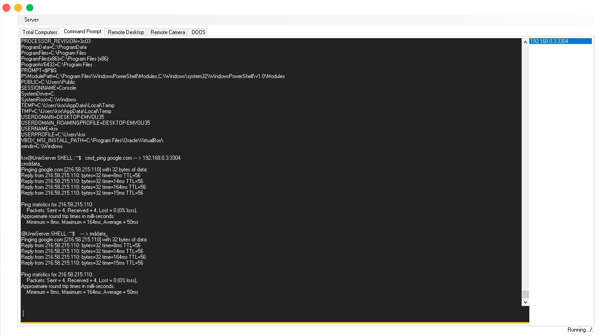

# Remote-Controller
Application for computer remote control in the local network

Supported functions  
   <input type="checkbox" name="option2" value="a2">Command Prompt 
   <input type="checkbox" name="option2" value="a2">Remote Desktop 
   <input type="checkbox" name="option2" value="a2">Remote WebCam 
 
  
   
    
     
